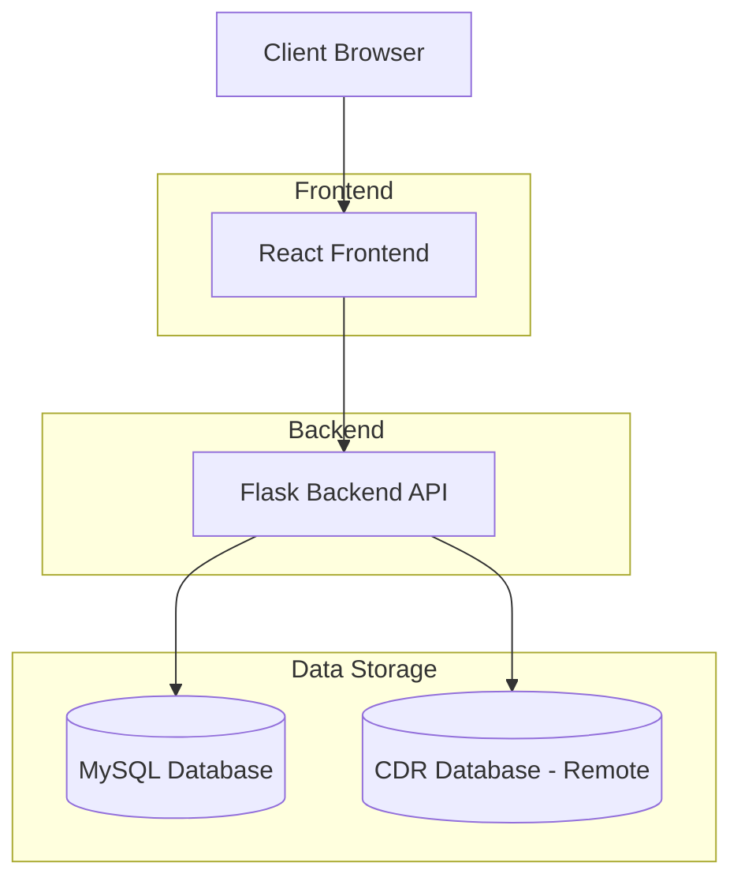

# Call Center Management System - Project Architecture

## Overview
This is a full-stack web application for managing call center operations with a React frontend and Flask backend. The system allows administrators and agents to track calls, manage agent information, and view detailed reports.

## System Architecture

## Backend (Flask API)

### Key Components
- **Flask Application**: Main application server
- **MySQL Connector**: Database connectivity
- **JWT Authentication**: Token-based authentication
- **CORS Support**: Cross-origin resource sharing

### API Endpoints

#### Authentication
- `POST /api/login` - User login with JWT token generation

#### Call Management
- `GET /api/calls` - Retrieve call details with filtering options
- `PUT /api/calls/<id>/custom` - Update custom fields for calls

#### Agent Management
- `GET /api/agents` - Retrieve all agents
- `POST /api/agents` - Add new agent (admin only)
- `PUT /api/agents/<agent_number>` - Update agent details (admin only)
- `DELETE /api/agents/<agent_number>` - Delete agent (admin only)

#### System Health
- `GET /api/health` - Health check endpoint
- `GET /api/test-cdr` - Test CDR database connection

### Database Schema

#### Users Table
- `id`: Primary key
- `user_id`: Unique user identifier
- `password`: User password
- `name`: User name
- `email`: User email
- `created_at`: Timestamp

#### Agents Table
- `id`: Primary key
- `agent_number`: Unique agent identifier
- `name`: Agent name
- `email`: Agent email
- `password`: Agent password
- `status`: Agent status (Active/Inactive)
- `is_admin`: Admin privileges flag
- `created_at`: Timestamp

#### Calls Table
- `id`: Primary key
- `agent_number`: Foreign key to agents
- `customer_number`: Customer phone number
- `duration`: Call duration in seconds
- `call_status`: Call status (Completed, Missed, In Progress, Failed)
- `timestamp`: Call timestamp
- `remarks`: Custom remarks
- `name`: Custom name field
- `remarks_status`: Custom remarks status

## Frontend (React + Tailwind)

### Key Features
- **Responsive UI**: Mobile-friendly design using Tailwind CSS
- **Authentication Flow**: Login and session management
- **Dashboard Views**: Multiple tabs for different reports
- **Data Export**: Export to Excel, CSV, PDF, and XML formats
- **Search and Filter**: Search functionality for calls and agents
- **Date Range Filtering**: Filter calls by date range
- **Agent Management**: CRUD operations for agents (admin only)

### Main Components

#### Authentication
- Login screen with form validation
- JWT token storage in localStorage
- Session persistence across browser sessions

#### Dashboard
- **Call Details Tab**: View all completed calls with custom fields
- **Missed Calls Tab**: View missed and failed calls with SIP calling capability
- **Agent Details Tab**: View and manage agent information

#### Data Management
- Real-time data fetching from backend API
- Client-side filtering and search
- Form validation for data entry
- Modal dialogs for add/edit operations

#### Export Functionality
- Export call data to multiple formats
- Export agent data to multiple formats
- Customizable export options

## Security Features
- JWT-based authentication
- Role-based access control (admin/agent)
- Protected API endpoints
- Secure password handling (plaintext in current implementation)

## Technology Stack

### Backend
- Python 3.7+
- Flask web framework
- MySQL database
- PyJWT for token management
- mysql-connector-python for database connectivity

### Frontend
- React 18+
- Tailwind CSS for styling
- Lucide React for icons
- XLSX for Excel export
- jsPDF for PDF generation
- file-saver for file downloads
- xml-js for XML export

## Deployment
- Backend runs on port 5000
- Frontend runs on port 3000
- API base URL configured as http://localhost:5000/api
- CORS enabled for development